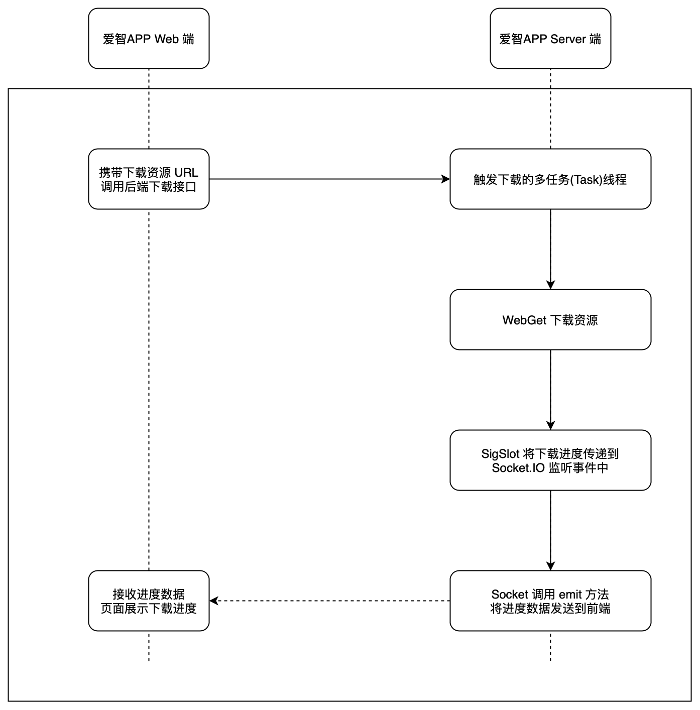

# app-demo-offline-downloader

这是一个在爱智上运行的离线下载示例APP

## JSRE 中运用到的技术点
- Task 多任务
- SigSlot 异步通信
- Socket.IO 订阅/发布
- WebGet 下载

## 原型设计


## 项目结构
```text
├── assets          资源文件夹                   
├── routers         路由信息 
├── public          静态页面文件
├── views           模板页面
├── web             前端页面项目，基于 vue3 版本，需要将打包之后的 /web/dist 中的文件移动到 /public 目录下进行替换
├── eslintrc.json   eslint 配置文件
├── edgeros.json    edgeros 应用配置文件
├── main.js         程序入口
├── jsconfig.json    代码补全配置文件
└── package.json    依赖包的管理
```


## 效果

下载页面


正在下载


下载完成


整体效果


